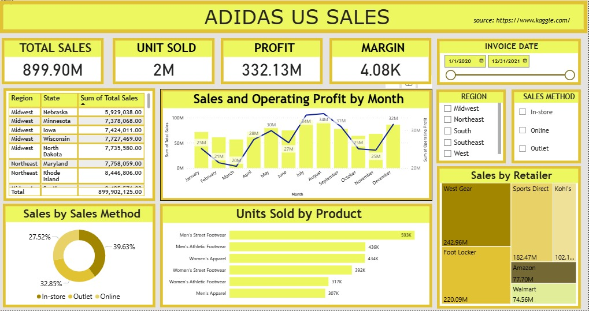

# 📚Adidas US Sales Dashboard

## 📝 **Deskripsi**

Dashboard ini bertujuan untuk menganalisis perfroma penjualan Adidas di Amerika Serikat tahun 2020-2021.

## 📸 Preview Chat Bot Psikologi

## 📝 **Fitur Utama**
1. KPI
2. Slicer
3. Visualisasi Utama
   - Sales & Profit by Month
     Tren performa penjualan dan profit sepanjang tahun
   - Sales by Region
     Kontribusi penjualan setiap wilayah
   - Sales by Method
     Kontribusi penjualan berdasarkan metode penjualan (In-store, Online, dan Outlet)
   - Unit Sold by Product
     Produk terjual berdasarkan kategori produk
   - Sales by Retailer
     Kontribusi penjualan berdasarkan retailer
     
## 📝 **Insight**
- Total penjualan Adidas di Amarika sepanjang tahun 2020-2021 tercatat sebesar $899,9M dengan 2M unit terjual, emnghasilka profit sebesar $332,13M dan margin $4,08K
- Profit menunjukkan tren naik di kuartal 2 & 3. Profit tertinggi di bulan September sebesar $40M, profit terendah terjadi di bulan Maret sebesar $20M
- Metode penjualan In-Store memiliki kontribusi penjualan tertinggi sebesar 39,63%
- West Gear merupakan retailer dengan penjualan tertinggi sebesar $242,96M diikuti Foot Locker sebesar $220,09M 

